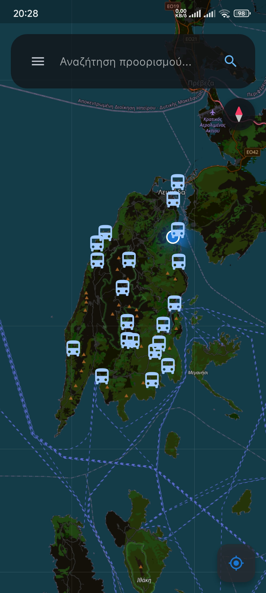
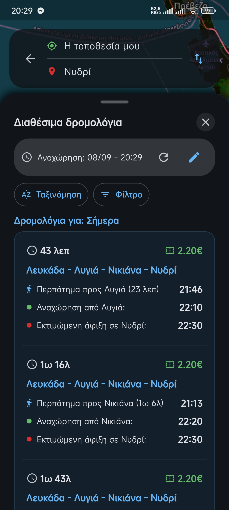
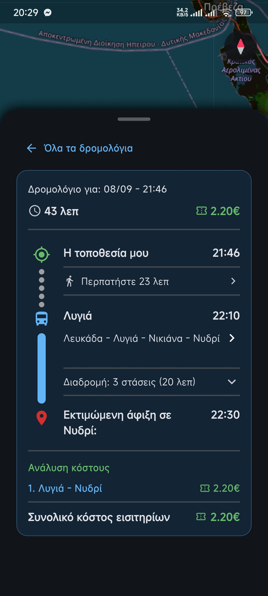
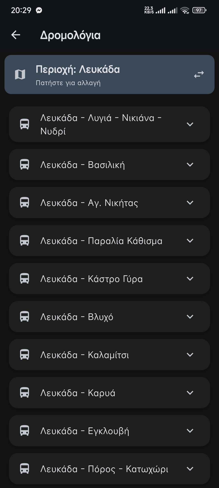
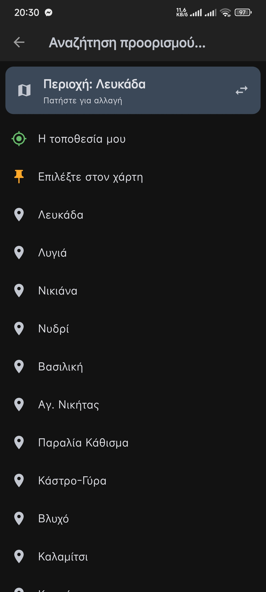
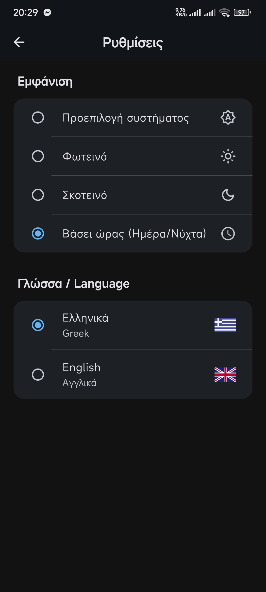

# Local KTEL – Bus Timetables & Routing


 Local KTEL is a Flutter app that provides easy access to regional bus schedules and real-time routing across Greece.

 It uses open GTFS data, offline-first caching, and multimodal trip planning (walk + bus) with OSRM.

 ## 📱 Features

 - **GTFS-based timetables** – All stops, routes, trips, and calendar information.
- **Offline-first region loading** – Download and extract region data once, then use it offline.
- **Multimodal routing** – Combines walking (OSRM) and bus legs with transfer support.
- **Interactive map** – Built with `flutter_map`; shows routes, stops, your location, and compass orientation.
- **Search & pick** – Search for stops, choose a point on the map, or use your current location.
- **Filter & sort trips** – By duration, transfers, cost, walking time, and other criteria.
- **Region management** – Switch regions, download new ones, update them in the background, or delete them.
- **Localisation** – Full Greek / English support, including transliteration (Greeklish) for geocoding.
- **Theme** – Light, dark, system, and time-based (day/night) modes.

 ## 🗺️ Screenshots

### Home



### Trips



### Route Details



### Routes



### Destination Search



### Settings



 ## 🛠️ Tech Stack

 | Component | Technology |
| --- | --- |
| Framework | Flutter 3.38.7 |
| UI | Material 3 |
| State management | `ValueNotifier` / `ChangeNotifier` |
| Maps | `flutter_map` \+ OpenStreetMap tiles |
| Tile caching | `flutter_map_tile_caching` |
| Routing | OSRM (walking & driving) |
| Data format | GTFS CSV |
| Storage | `shared_preferences` \+ local files |
| Geocoding | Nominatim |
| Location | `geolocator` |
| Compass | `flutter_compass` |
| Internationalisation | `flutter_localizations` \+ `intl` |

 ### Routing

 OSRM is used to calculate walking routes to and from bus stops. Bus legs are calculated from GTFS data and visualised together with the walking portions.

 ### GTFS Data

 The app parses standard GTFS files including:

 - `stops.txt`
- `routes.txt`
- `trips.txt`
- `stop_times.txt`
- `calendar.txt`

 ## 📁 Project Structure

 Simplified project structure:

```
lib/
├── delegates/          # Search delegates (stops, regions)
├── gtfs/               # GTFS loaders, managers, storage, remote manifest
├── l10n/               # Localisation files (ARB generated)
├── models/             # Data classes (Stop, Route, Trip, BusTrip, etc.)
├── screens/            # Main UI screens (Home, Welcome, Settings, Info, ...)
├── services/           # Business logic (routing, location, compass, ...)
├── theme/              # App theme (light/dark, extensions)
├── utilities/          # Helpers (time, distance, language, region utils)
└── widgets/            # Reusable UI components
```

 ## 🚀 Getting Started

 ### Prerequisites

 Before running the project, make sure you have:

 - [Flutter](<https://flutter.dev/>) SDK `≥ 3.22`
- Android Studio and/or Xcode for emulators and device development
- An internet connection for the initial region data download

 > **Note:** Region data is cached locally after the first download and can then be used offline.

 ### Installation

 #### 1\. Clone the repository

```
git clone https://github.com/thalis-ap/KtelTransit.git
cd KtelTransit
```

 #### 2\. Get dependencies

```
flutter pub get
```

 #### 3\. Run the app

```
flutter run
```

 > **Note:** The app downloads the region manifest from the remote repository the first time it runs. A bundled fallback manifest can also be used when the app is offline.

 ## 📦 Data & Region Management

 Regions are defined in a public GitHub repository.

 Each region contains:

```
region_name/
├── gtfs.zip
```

 The app checks for region updates automatically in the background and refreshes region data silently when updates are available.

 Users can:

 - Download regions
- Refresh region data
- Switch between regions
- Delete downloaded regions
- Update regions in the background

 The region picker can be accessed through the search delegate. Long-pressing a region provides additional region management actions.

 ## 🧭 Routing Logic

 The app supports both pure walking routes and multimodal walking + bus routes.

 ### Pure Walking

 A direct walking route is calculated between the origin and destination using OSRM.

```
Origin
  │
  ▼
Walking
  │
  ▼
Destination
```

 ### Bus + Walking

 For a multimodal trip, the routing process is approximately:

```
Origin
  │
  ▼
Find nearby stops
  │
  ▼
OSRM walking route
  │
  ▼
GTFS bus trip
  │
  ▼
Optional transfers
  │
  ▼
GTFS bus trip
  │
  ▼
OSRM walking route
  │
  ▼
Destination
```

 The routing process:

 1. Finds the nearest suitable stops to the origin and destination.
2. Uses OSRM to calculate actual walking routes to and from those stops.
3. Queries GTFS data for available bus trips.
4. Combines walking and bus legs into a complete multimodal trip.
5. Supports transfers between multiple bus legs.
6. Calculates waiting and walking times.
7. Filters and sorts trips according to the user's preferred criteria.

 ### Trip Filtering & Sorting

 Trips can be filtered and sorted according to criteria such as:

 - Total duration
- Number of transfers
- Cost
- Walking time
- Waiting time
- Other user-preferred criteria

 ## 🌐 Localisation

 The app currently supports:

 - 🇬🇷 Greek (`el`)
- 🇬🇧 English (`en`)

 Translation files are located in the `l10n/` directory and are generated from ARB files.

 ### Greeklish Transliteration

 Greek characters are automatically transliterated into Greeklish where appropriate for geocoding and search operations.

 For example:

```
Αθήνα → Athina
Θεσσαλονίκη → Thessaloniki
Πάτρα → Patra
```

 This improves compatibility with geocoding services as dropped pin names appear in Latin characters when locale is set to 'en'.

 ## 🎨 Theme

 The app supports multiple theme modes:

 - Light
- Dark
- System
- Time-based

 The time-based theme can automatically switch between day and night appearance according to the current time.

 ## 🗺️ Maps & Geocoding

 The map interface is built with `flutter_map` and uses OpenStreetMap tiles.

 The map can display:

 - Bus stops
- Routes
- Walking paths
- User location
- Compass orientation

 Map tiles are cached locally using `flutter_map_tile_caching` to improve offline usability.

 Nominatim is used for reverse geocoding.


 ## 📄 License

 Distributed under the MIT License.

 See `LICENSE` for more information.

 ## 🙏 Acknowledgements

 This project makes use of and/or relies on the following open-source projects and data providers:

 - [OpenStreetMap](<https://www.openstreetmap.org/>) – Map data and tiles
- [Nominatim](<https://nominatim.org/>) – Geocoding and reverse geocoding
- [OSRM](<https://project-osrm.org/>) – Route calculations
- GTFS data provided by regional KTEL agencies
- Material Design icons

---
